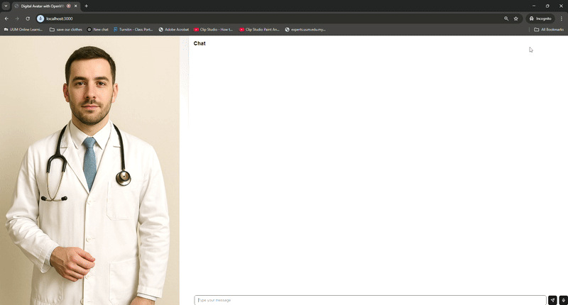
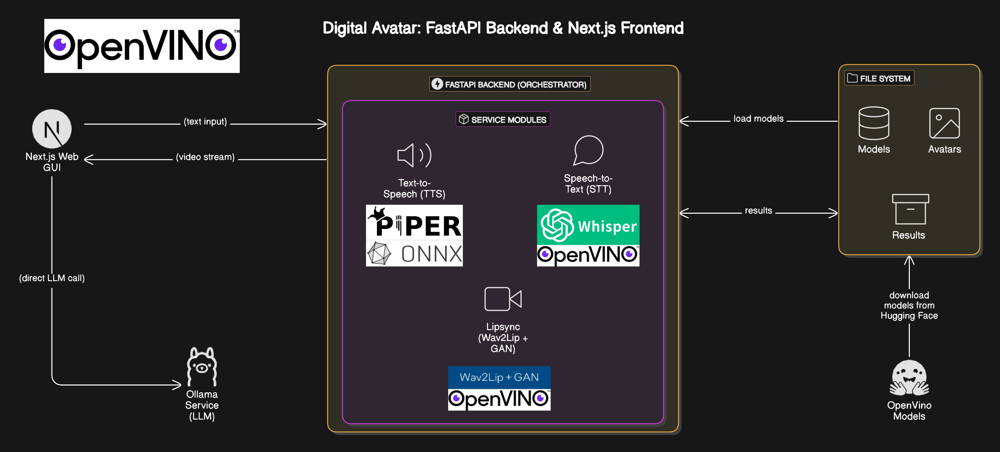

# Local Digital Avatar
## Demonstration


Watch a demonstration video of the Digital Avatar in action: [Watch Demonstration Video on Vimeo](https://player.vimeo.com/video/1084889690?h=d986013c37&badge=0&autopause=0&player_id=0&app_id=58479)


---
## Setup

This project is an extension and refactoring of the original Digital Avatar solution developed by Intel. The original implementation (found [here](https://github.com/intel/edge-developer-kit-reference-scripts/tree/main/usecases/ai/digital-avatar)) relies on a microservices architecture deployed using Docker containers for components like STT, TTS, and Lipsync.

Our extension simplifies deployment by combining the core functionalities into a **single FastAPI application**. This eliminates the need for separate Docker container management for each service, streamlining the setup and deployment process on compatible hardware.

---

### Architecture Diagram

To understand how the different components of this Digital Avatar solution interact, please refer to the architecture diagram below. It illustrates the flow of data between the frontend, backend services, and external dependencies.



---
### Hardware
This solution has been validated on the following hardware configuration:

* **System:** ASUS NUC 14 Pro AI Mini-PC
* **Processor:** Intel® Core Ultra 7 Processor 258V
* **RAM:** 32GB
* **Disk:** 256GB SSD
* **Graphics:** Integrated - Intel® Arc Graphics (validated as Intel® Arc 140V/130V GPU)

The primary validated device for Lipsync inference in this setup is **CPU**. GPU drivers are required for system compatibility and potential future GPU acceleration within OpenVINO or other libraries.

---
### Steps

To set up the project, follow these steps:

1.  **Operating System:**
    * The setup has been validated on **Ubuntu 24.04 LTS**. It is recommended to use this OS version for consistency.

2.  **Install Intel GPU Drivers:**
    * Proper Intel GPU drivers are essential for using Intel graphics (including integrated Arc).
    * Install the necessary drivers by following the instructions provided in the original Intel Digital Avatar repository's README: [Link to Intel Driver Installation Guide](https://github.com/intel/edge-developer-kit-reference-scripts/blob/main/README.md)
    * *Note: Even if primarily using the CPU for Lipsync, these drivers are fundamental for the system's hardware acceleration capabilities.*

3.  **Install Python Dependencies:**
    * It's highly recommended to use a virtual environment to manage project dependencies. We will use Python 3.11, which is available on Ubuntu 24.04.
    * We will use `uv`, a fast Python package installer and resolver, for quick setup.
    * Navigate to the project root directory.
    * Create a Python 3.11 virtual environment named `.venv`:
        ```bash
        uv venv --python 3.11 .venv
        ```
    * Activate the virtual environment:
        ```bash
        source .venv/bin/activate
        ```
    * Install the required packages listed in `requirements.txt` using `uv`:
        ```bash
        uv pip install -r requirements.txt
        ```
    * *(Remember to keep the virtual environment activated when running the application.)*

4.  **Download Required Model Files:**
    * All neural network models and data files required by the services (STT, TTS, Lipsync) must be downloaded and placed in a specific directory.
    * Create the target directory:
        ```bash
        mkdir -p ./data/models
        ```
    * Download the necessary files (links will be provided below or separately) and place them inside the `./data/models` folder. [Download model files here](https://huggingface.co/qizunlee/digital-avatar/tree/main)

5.  **Prepare Avatar Video:**
    * The Lipsync service requires a base video of an avatar.
    * Place a **video.mp4** file in the `./assets` folder.
    * The video should feature an idle person (preferably showing at least the upper half of the body) with subtle movements like blinking or slight body motion. It is crucial that the person is **not speaking** in this base video.
    * Ensure the file is named exactly `video.mp4`.

    * The first time of initialization for the avatar will take longer time; subsequent runs will be much shorter since it saves a cache of the avatar video file's face detection results.

6.  **Setup Environment Variables:**
    * Configuration settings for the application are managed via a `.env` file.
    * Create a local `.env` file by copying the template:
        ```bash
        cp .env.template .env
        ```
    * Review the created `.env` file and adjust settings such as model paths, device preferences (`LIPSYNC_DEVICE=CPU` for validated setup), data directories, etc., as needed for your specific environment.
    * **Changing TTS Voice:** The default TTS speaker is configured in `combined_backend/config.py`. The current default is a male voice. To change it, open `combined_backend/config.py` and modify the `PIPER_TTS_DEFAULT_SPEAKER` variable to the name of one of the available voices (`male` or `female`).

7.  **Setup Ollama (for Local LLM):**
    * The service utilizes Ollama to run a local language model.
    * First, download and install Ollama by following the official instructions: [Download Ollama](https://ollama.com/download/linux)
    * Once Ollama is installed and running, pull the specific model you prefer. In the validated setup, **qwen3:4b** was used:
        ```bash
        ollama pull qwen3:4b
        ```
    * Ensure the Ollama service is running before you start the FastAPI application:
        ```bash
        ollama serve
        ```

8.  **Device for STT and Lipsync Service:**
    * The device for STT and Lipsync Services can be changed in the `.env` file.
    * Current setup only support **CPU** or **GPU**.

9.  **Start the FastAPI Server:**
    * Once all the above steps are completed, you can start the FastAPI server by running the main application script.
    * Make sure your Python virtual environment (`.venv`) is activated and that the Ollama service (`ollama serve`) is running in a separate terminal if you plan to use the RAG functionality.
    * Navigate to the `/combined_backend/` directory in your terminal.
    * Run the app script:
        ```bash
        python3 app.py
        ```

---

## Generating AI Avatar Video

If you don't have a suitable base video (`video.mp4`) for the avatar, you can generate one using AI tools. The following steps outline a process using ChatGPT to generate an image concept and VEO 2 to turn that concept into a video.

1.  **Generate an AI Avatar Image Concept (using ChatGPT):**
    * Go to the ChatGPT website or your preferred AI text generator.
    * Use a prompt to describe the kind of realistic human avatar image you want. For example:
        ```
        generate me a realistic human, potrait mode, standing, with clear background
        ```
    * Refine the prompt until you get a description that allows an image generator to create a suitable image.

2.  **Generate AI Avatar Video (using VEO 2):**
    * Go to the VEO 2 website for video generation: [https://aistudio.google.com/generate-video](https://aistudio.google.com/generate-video)
    * Use the image or the prompt you generated in the previous step as input for VEO 2.
    * Generate the video based on your desired avatar appearance.

3.  **Save and Place the Video:**
    * Download the video generated by VEO 2.
    * Rename the downloaded video file exactly to `video.mp4`.
    * Place this `video.mp4` file into the `./assets` folder of this repository.

4.  **Example Videos:**
    * You can find example AI-generated avatar image and the respective video created using a similar method in the `./example_avatar` directory within this repository. These can serve as references for the type of video required.

---